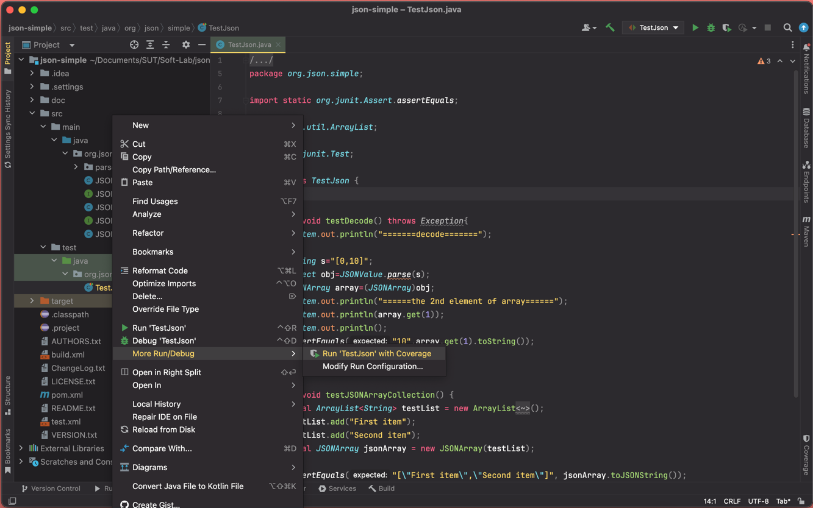
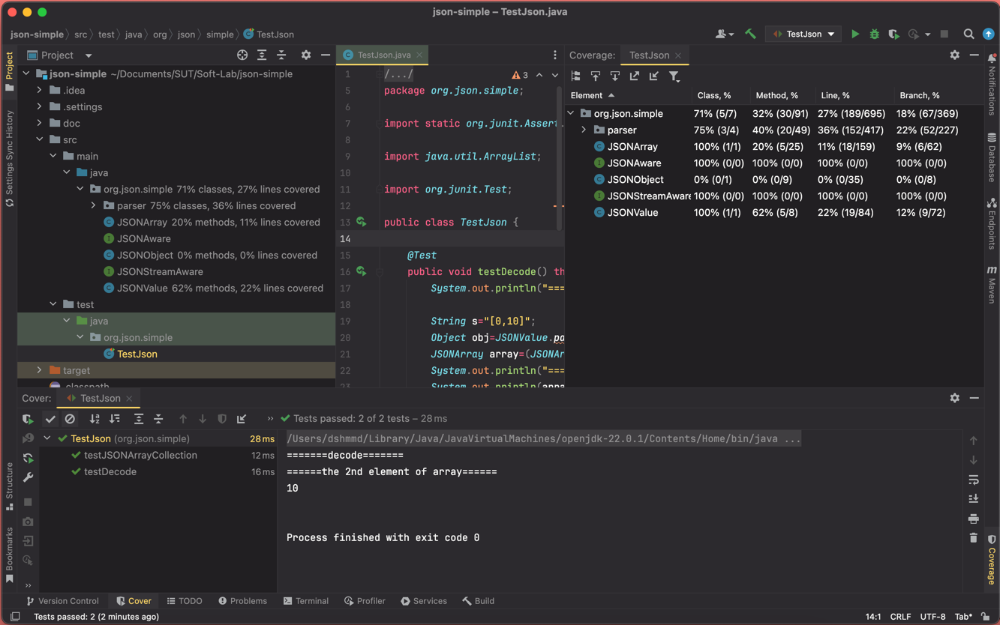
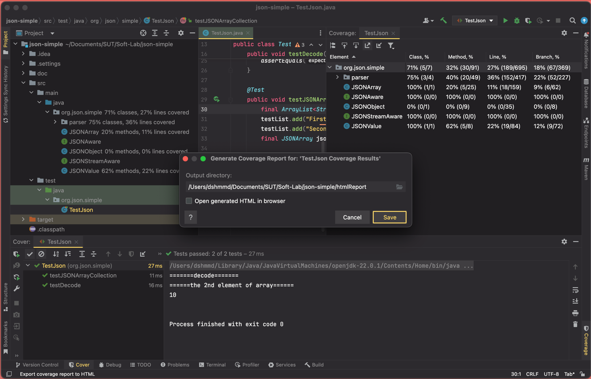
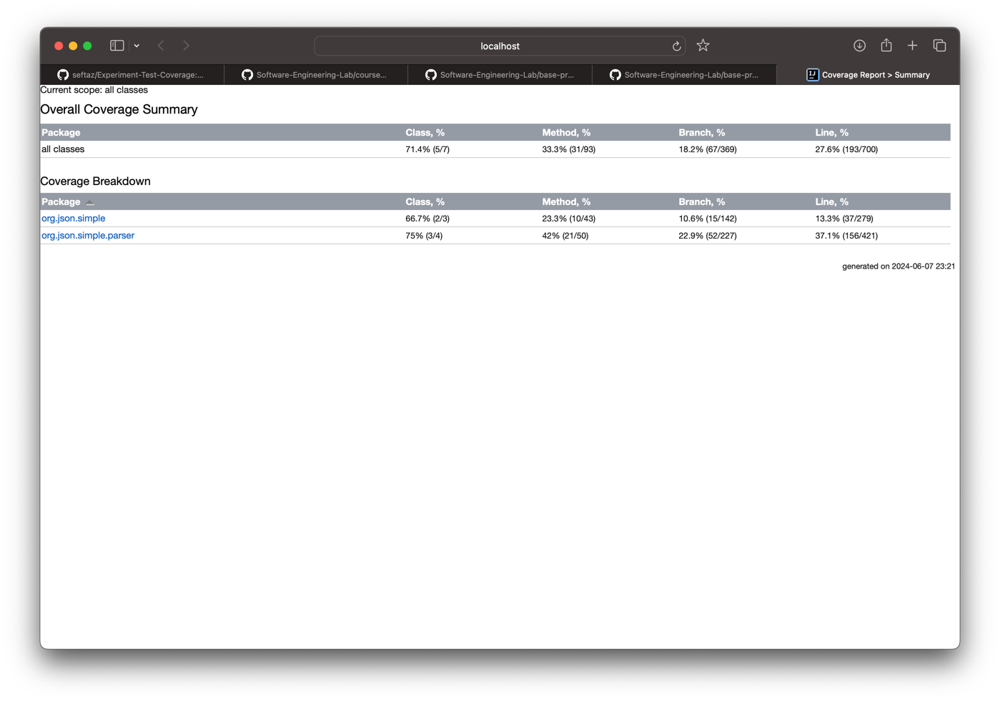
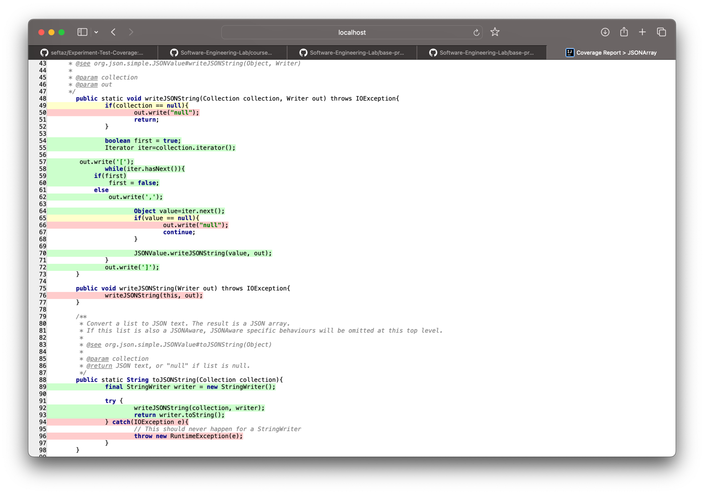
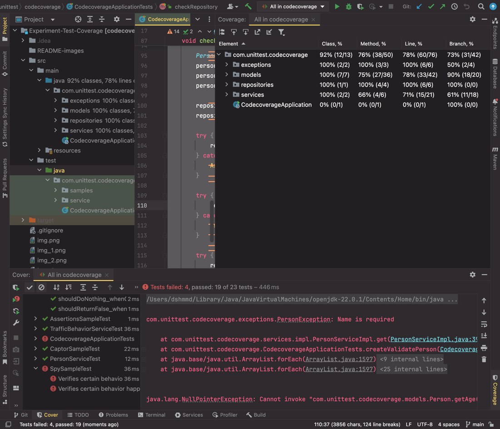

## بخش اول: بررسی coverage در پروژه‌ی simple json

در ابتدا، طبق مراحل آموزش داده شده پیش می‌رویم.

- 

- 

ساخت فایل coverage report:

- 
- 
- 

## بخش دوم: ارتقای coverage در پروژه اصلی

 #### به صورت کلی، می‌بینیم که تست‌ها به صورت کامل پروژه را کاور کرده‌اند. فارغ از یکسری نقص جزیی در پروژه که منجر به شکست برخی تست‌ها می‌شود، حال ببینیم که هر تست چه چیزی را بررسی می‌کند. 

### بررسی تست‌ها

## CodecoverageApplicationTests

### checkingTrafficService

تست بررسی رفتار عابر پیاده در عبور از خیابان تحت شرایط مختلف چراغ راهنمایی.
- مقداردهی `Footpassenger` و `Traffic` با مقادیر اولیه.
- تلاش اول برای عبور: انتظار عدم استثنا.
- تلاش دوم برای عبور: انتظار `BehaviorException` با پیام "You should'nt do that, reckless person".
- تلاش سوم برای عبور: انتظار `BehaviorException` با پیام "You should be more careful".

### createValidatePerson

تست اعتبارسنجی و ایجاد شخص.
- مقداردهی `Person` با نام و سن.
- تلاش برای درج شخص اول: انتظار `PersonException` با پیام "Gender is required".
- تلاش برای درج شخص دوم: انتظار `PersonException` با پیام "Name is required".
- بررسی عدم وجود شخص با نام "Ali" در سرویس.

### checkRepository

تست عملکرد مخزن افراد.
- مقداردهی `PersonRepository` و دو شخص.
- درج افراد در مخزن.
- تلاش برای درج، به‌روزرسانی و حذف شخص null: انتظار `NullPointerException`.

## PersonServiceTest

### testInsert_shouldInsertPersonWithSuccessWhenAllPersonsInfoIsFilled

این تست بررسی می‌کند که اگر تمام اطلاعات شخص کامل باشد، شخص به درستی درج می‌شود.
- ایجاد شیء `Person` با نام، سن و جنسیت.
- شبیه‌سازی موفقیت در درج شخص با استفاده از `Mockito`.
- فراخوانی متد `insert` و اطمینان از درج موفقیت‌آمیز.

### testInsert_shouldThrowPersonExceptionWhenPersonIsNull

این تست بررسی می‌کند که اگر شخص null باشد، اکسپشن `PersonException` با پیام مناسب پرتاب شود.
- تعریف پیام و خطاهای مورد انتظار.
- فراخوانی متد `insert` با شخص null و بررسی پرتاب اکسپشن با پیام مورد انتظار.

### testInsert_shouldThrowPersonExceptionWhenPersonNameIsNull

این تست بررسی می‌کند که اگر نام شخص null باشد، اکسپشن `PersonException` با پیام مناسب پرتاب شود.
- تعریف پیام و خطاهای مورد انتظار.
- ایجاد شیء `Person` بدون نام.
- فراخوانی متد `insert` و بررسی پرتاب اکسپشن با پیام مورد انتظار.

### testInsert_shouldThrowPersonExceptionWhenPersonNameIsBlank

این تست بررسی می‌کند که اگر نام شخص خالی باشد، اکسپشن `PersonException` با پیام مناسب پرتاب شود.
- تعریف پیام و خطاهای مورد انتظار.
- ایجاد شیء `Person` با نام خالی.
- فراخوانی متد `insert` و بررسی پرتاب اکسپشن با پیام مورد انتظار.

### testInsert_shouldThrowPersonExceptionWhenPersonGenderIsNull

این تست بررسی می‌کند که اگر جنسیت شخص null باشد، اکسپشن `PersonException` با پیام مناسب پرتاب شود.
- تعریف پیام و خطاهای مورد انتظار.
- ایجاد شیء `Person` بدون جنسیت.
- فراخوانی متد `insert` و بررسی پرتاب اکسپشن با پیام مورد انتظار.

## TrafficBehaviorServiceTest

### testFootpassengerCrossTheStreet_shouldThrowBehaviorExceptionWhenFootpassengerCrossesTheRoadDuringHeavyTrafficAndWhileTheTrafficLightIsRed

این تست بررسی می‌کند که اگر عابر پیاده در ترافیک سنگین و چراغ قرمز از خیابان عبور کند، اکسپشن `BehaviorException` با پیام مناسب پرتاب می‌شود.
- ایجاد شیء `Traffic` با ترافیک سنگین.
- ایجاد شیء `Footpassenger` با عبور از خیابان و چراغ قرمز.
- فراخوانی متد `footpassengerCrossTheStreet` و بررسی پرتاب اکسپشن با پیام "You should'nt do that, reckless person".

### testFootpassengerCrossTheStreet_shouldThrowBehaviorExceptionWhenFootpassengerCrossesTheRoadDuringHeavyTrafficWithoutLookSides

این تست بررسی می‌کند که اگر عابر پیاده در ترافیک سنگین بدون توجه به اطراف از خیابان عبور کند، اکسپشن `BehaviorException` با پیام مناسب پرتاب می‌شود.
- ایجاد شیء `Traffic` با ترافیک سنگین.
- ایجاد شیء `Footpassenger` با عبور از خیابان و چراغ سبز، بدون نگاه کردن به اطراف.
- فراخوانی متد `footpassengerCrossTheStreet` و بررسی پرتاب اکسپشن با پیام "You should be more careful".

## AssertionsSampleTest

### whenAssertingArraysEquality_thenEqual

این تست بررسی می‌کند که دو آرایه کاراکتری برابر هستند.
- آرایه `expected` شامل حروف 'J', 'a', 'v', 'a'.
- تبدیل رشته "Java" به آرایه `actual`.
- اطمینان از برابری دو آرایه با استفاده از `assertArrayEquals`.

### whenAssertingEquality_thenEqual

این تست بررسی می‌کند که مقادیر محاسبه‌شده مربع و مستطیل برابر هستند.
- محاسبه مربع و مستطیل.
- اطمینان از برابری مقادیر با استفاده از `assertEquals`.

### whenAssertingConditions_thenVerified

این تست بررسی می‌کند که شرایط مختلف درست هستند.
- بررسی بزرگتر بودن 5 از 4.
- بررسی تساوی null با null.
- اطمینان از درستی شرایط با استفاده از `assertTrue`.

### whenAssertingNull_thenTrue

این تست بررسی می‌کند که یک شیء null است.
- مقداردهی شیء به null.
- اطمینان از null بودن شیء با استفاده از `assertNull`.

### whenAssertingNotNull_thenTrue

این تست بررسی می‌کند که یک شیء null نیست.
- مقداردهی شیء با یک شیء جدید.
- اطمینان از null نبودن شیء با استفاده از `assertNotNull`.

### whenAssertingSameObject_thenSuccessfull

این تست بررسی می‌کند که دو شیء یکسان هستند.
- مقداردهی رشته `language` با "Java".
- ایجاد `Optional` از رشته.
- اطمینان از یکسان بودن شیء رشته و مقدار داخل `Optional` با استفاده از `assertSame`.

### whenAssertingException_thenThrown

این تست بررسی می‌کند که یک اکسپشن خاص پرتاب می‌شود.
- بررسی پرتاب اکسپشن `IllegalArgumentException` با پیام "Exception message".
- اطمینان از برابری پیام اکسپشن با استفاده از `assertEquals`.

## CaptorSampleTest

### whenUseCaptorAnnotation_thenTheSame

این تست بررسی می‌کند که از `ArgumentCaptor` برای گرفتن مقدار آرگومان استفاده می‌شود.
- شبیه‌سازی `mockedList` و افزودن مقدار "one".
- استفاده از `verify` برای تأیید اضافه شدن مقدار به `mockedList`.
- گرفتن مقدار اضافه‌شده با `argCaptor` و اطمینان از برابر بودن آن با "one" با استفاده از `assertEquals`.

## MockSampleTest

### shouldReturnFalse_whenAddSomeString

این تست بررسی می‌کند که متد `add` با هر رشته‌ای مقدار `false` برمی‌گرداند.
- ایجاد شیء `MyCustomList` به صورت mock.
- تنظیم `when` برای متد `add` که با هر رشته‌ای `false` برگرداند.
- اطمینان از بازگشت مقدار `false` با استفاده از `assertFalse`.

### shouldDoNothing_whenClear

این تست بررسی می‌کند که متد `clear` هیچ عملی انجام نمی‌دهد.
- ایجاد شیء `MyCustomList` به صورت mock.
- تنظیم `doNothing` برای متد `clear`.
- فراخوانی متد `clear` و اطمینان از عدم بروز خطا.

### shouldAnswerSomeString_whenGetItemByIndex

این تست بررسی می‌کند که متد `get` با هر اندیسی مقدار "Item" برمی‌گرداند.
- ایجاد شیء `MyCustomList` به صورت mock.
- تنظیم `doAnswer` برای متد `get` که "Item" برگرداند.
- اطمینان از بازگشت مقدار "Item" با استفاده از `assertEquals`.

## SpySampleTest

### whenUsingTheSpyAnnotation_thenObjectIsSpied

این تست بررسی می‌کند که رفتارهای خاص حداقل یک بار رخ داده‌اند.
- ایجاد شیء `spyList` به صورت اسپای از `ArrayList`.
- اضافه کردن "one" و "two" به `spyList`.
- اطمینان از اینکه متد `add` برای "one" و "two" فراخوانی شده است.
- بررسی اندازه `spyList` با استفاده از `assertEquals` برابر 2.

### whenUsingTheSpyAnnotation_thenObjectIsSpiedMoreThanOneTime

این تست بررسی می‌کند که رفتارهای خاص حداقل دو بار رخ داده‌اند.
- ایجاد شیء `spyList` به صورت اسپای از `ArrayList`.
- دو بار اضافه کردن "one" به `spyList`.
- اطمینان از اینکه متد `add` برای "one" دو بار فراخوانی شده است.
- بررسی اندازه `spyList` با استفاده از `assertEquals` برابر 2.