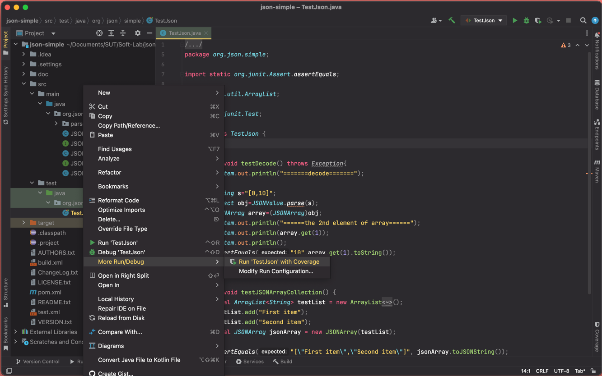
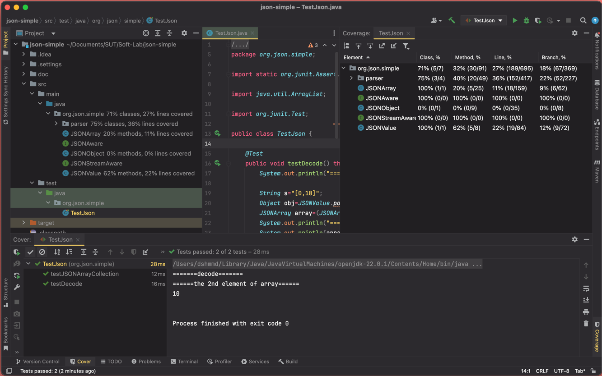
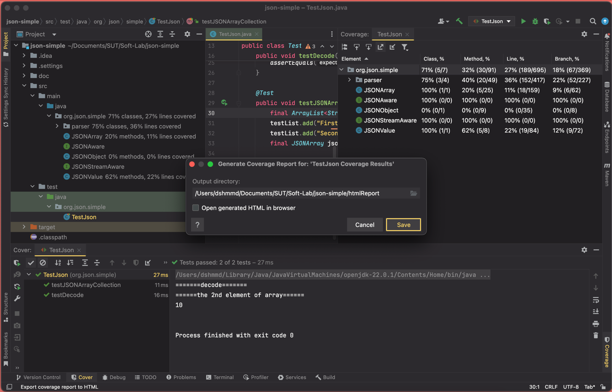
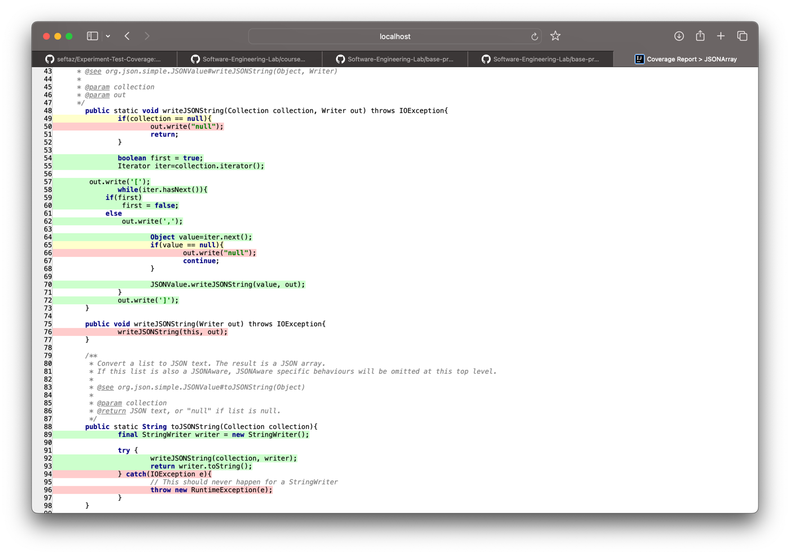

# unittest.with.codecoverage
### _Demo of unit test with code coverage_

## Content
- Unit test exemples with jUnit5 and Mockito
- JaCoCo for code coverage report
- Dificult: Beginner

## Executions
- mvn clean install -DskipTests
- mvn jacoco:report
- mvn test

### JaCoCo report report can be found at _target/site/jacoco/index.html_

Slides with content of the topic (pt-BR):  https://docs.google.com/presentation/d/1Dkz-qUYigPFynfNk8KcAeyTIxhUmaVTZ4DM6d5UjcJE/edit?usp=sharing

## بخش اول: بررسی coverage در پروژه‌ی simple json

در ابتدا، طبق مراحل آموزش داده شده پیش می‌رویم.

- 

- 

ساخت فایل coverage report:

- 
- 
- 
- 

